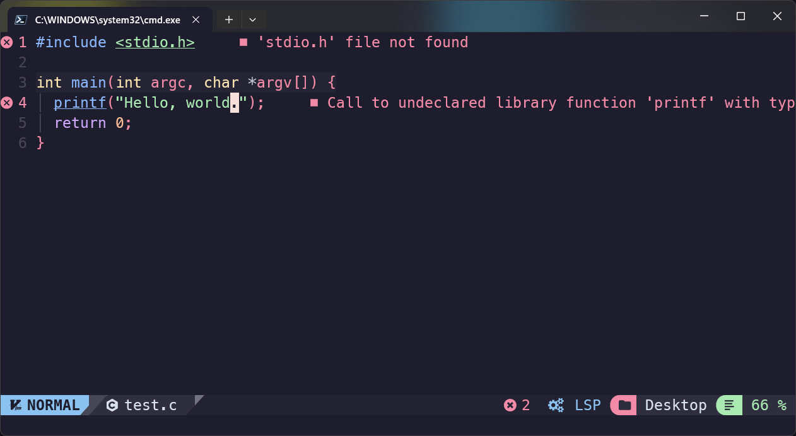

近日在使用一個 Neovim 的發行版 NVChad，設定 C/C++ 的 LSP Server。然後就遇到了標頭檔找不到的問題。



可以看到 Neovim 裡面的介面上面出現警告資訊：

```shell
'stdio.h' file not found
```

這就很奇怪了，根據我過往使用 gcc 的經驗，C library 應該是不用再額外引入的。

## 找資料

我的第一步就是直接上 Google 找：

```text
nvim clangd
```

於是我就找到了這一篇 stack overflow 的文章

- [What standard C library does Clang use? glibc, its own, or some other one?](https://stackoverflow.com/questions/59019932/what-standard-c-library-does-clang-use-glibc-its-own-or-some-other-one)

上面就詢問了 clang 是使用了哪一個 C 的函式庫。

>Clang does not come with its own C standard library. Rather, it ["supports a wide variety of C standard library implementations"](https://clang.llvm.org/docs/Toolchain.html#c-standard-library).
>
>Unix-like systems including Mac OS ship with their own. Windows does not. On Windows the default arrangement requires Microsoft's Visual C libraries to be installed. It seems that it's also possible to use Clang on Windows with MinGW's libraries though.
><br>╴<i class="fa-solid fa-user"></i> <em>hippietrail</em>

回覆的大略是說，Clang 並沒有自己的 C 函式庫。

## 解決

## 參考資料

- [--query-driver not having any effect #537](https://github.com/clangd/clangd/issues/537#issuecomment-1479544442)
